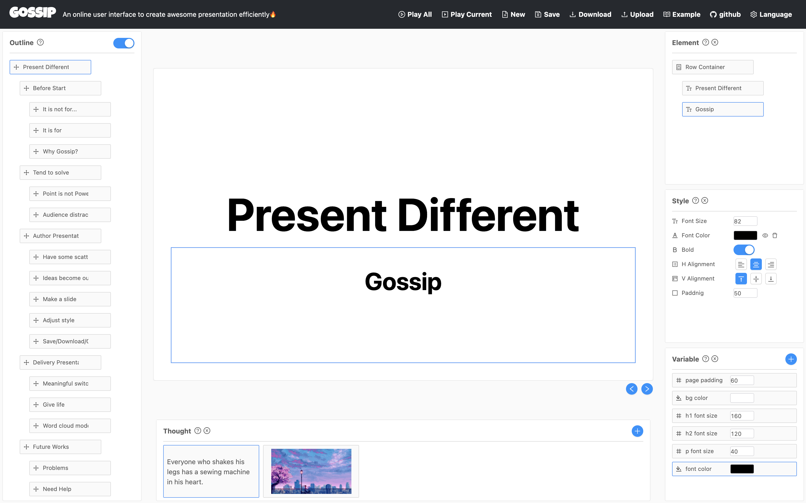

# Gossip 1.0

- [Gossip 1.0](#gossip-10)
  - [Overview](#overview)
  - [Why is it](#why-is-it)
  - [Get Started](#get-started)
  - [Features](#features)
  - [Limitations](#limitations)
  - [Future works](#future-works)
  - [How To Contribute](#how-to-contribute)
  - [Technology stack](#technology-stack)
  
## Overview

Gossip is an online user interface to create awesome presentation efficiently. If you are in China you can try it [here](https://pearmini.gitee.io/gossip/), otherwise [here](https://pearmini.github.io/gossip/). Please use Chrome, Firefox or Safari for better experience.

There is a view in [**Sapiens: A Brief History of Humankind**](https://en.wikipedia.org/wiki/Sapiens:_A_Brief_History_of_Humankind) that the ability to tell and share stories makes humans far more strong than animals, because stories allow us to trust strangers which led to large-scale cooperation.

Presentation is a good way of telling and sharing stories, and gossip is one the favorite kinds of story which we talk anytime. So I name the software as **Gossip** in order to build a tool that enable users to create and tell stories more efficient and convenient.

**Make you next PPT not a PPT.**

## Why is it

Gossip is inspired by [impress.js](https://github.com/impress/impress.js). Although impress.js is impressive, it is also hard to use because you must code... In the meantime, existing tools to author and delivery presentation do have some problems which can't be ignored.

On the one hand, existing tools make the authors pay more attention on graphics design of each slides, rather than the efficiency of transmitting information and the whole structure of the presentation.

On the other hand, it is difficult for them to provide the audience more context during delivering presentation, such as the relationship between previous and current slide, the position of the slide in the all of slides, etc.

## Get Started

There is a [tutorials in Chinese](./tutorials.zn.md) to familiarize you with all the techniques you need know to author and delivery presentation by Gossip. And there is a upcoming tutorials in English.

## Features

- Powerful outline.
- Only a small amount of drag and alignment is required for the layout of the operation.
- More free and convenient modification of styles.
- Automatically generate transition and overview mode in impress.js.
  
## Limitations

There are some limitations in Gossip now.

- Outline is not flexible enough.
- Variables are not easy enough to use.
- Layout method is not convent enough.
- No support for animation, template, shortcuts, redo, undo, etc.
- The context provided during delivering is not enough.
- Word cloud mode have some problems.

## Future works

- Solve the problems mentioned above.
- Design a better UI.

## How To Contribute

Gossip 1.0 is just a course project, we need you encourage and advice to improve the code and features of it.

If you like Gossip, not only can you star it, you can also do the following things.

- Join [Telegram](https://t.me/joinchat/S4-TmBwTcGFnmSYM0gxsdw) to discuss.
- Give us the slides you made by Gossip and we will display some of them.
- Fill out the [questionnaire](https://www.wjx.cn/jq/77277467.aspx).
  
## Technology stack

[umi@2.x](https://v2.umijs.org/) + [antd@3.x](https://3x.ant.design/)
