# Gossip 1.0

- [Gossip 1.0](#gossip-10)
  - [Overview](#overview)
  - [Getting started](#getting-started)
  - [Why bother?](#why-bother)
    - [Hard to author a presentation](#hard-to-author-a-presentation)
    - [Hard to deliver a presentation](#hard-to-deliver-a-presentation)
  - [Author a presentation](#author-a-presentation)
    - [Generating: Idea](#generating-idea)
    - [Organizing: Outline and Thumbnails](#organizing-outline-and-thumbnails)
    - [Composing: Main and Element](#composing-main-and-element)
    - [Revising: Style and Variable](#revising-style-and-variable)
  - [Delivery a presentation](#delivery-a-presentation)
    - [Switch animation: Zoom in, Zoom out, Rotate](#switch-animation-zoom-in-zoom-out-rotate)
    - [Overview: Word Cloud mode](#overview-word-cloud-mode)
  - [Limitations](#limitations)
  - [Future works](#future-works)
  - [Contributing](#contributing)
  - [Tech stack](#tech-stack)
  
## Overview

Gossip is an online user interface to efficiently author and delivery beautiful and enlightening presentations. If you are in China, you can try it [here](https://pearmini.gitee.io/gossip/), otherwise [here](https://pearmini.github.io/gossip/). Please use Chrome, Firefox, or Safari for a better experience.

There is a view in [**Sapiens: A Brief History of Humankind**](https://en.wikipedia.org/wiki/Sapiens:_A_Brief_History_of_Humankind) that the ability to tell and share stories makes humans far more strong than animals because stories allow us to trust strangers which led to large-scale cooperation.

Presentation is an excellent way of telling and sharing stories, and gossip is one of the favorite kinds of stories that we talk about any time. Therefore, I name the software as **Gossip** to build a tool that enables users to produce and convey stories more efficiently and conveniently.

**Make your next presentation not a presentation.**

## Getting started

There is a [tutorial in Chinese](./tutorials.zh.md) to help you with all the techniques you need to know to create and deliver presentations by Gossip. And there is an upcoming tutorial in English.

## Why bother?

Gossip is inspired by [impress.js](https://github.com/impress/impress.js). Although impress.js is impressive, it is also hard to use because you must code... In the meantime, existing tools to author and delivery presentation do have some problems which can't be ignored.

### Hard to author a presentation

On the one hand, existing tools make the authors pay more attention to the graphics design of each slide, rather than the efficiency of transmitting information and the whole structure of the presentation.

The presenter ultimately has to decide what information will be included in the presentation, **how that information will be organized, and how to best turn that organization into a story for the target audience.**

### Hard to deliver a presentation

On the other hand, it is difficult for existing tools to provide the audience more context to hold their interest during delivering presentations, such as the individual slides relate to one another or how they fit into the larger structure of the presentation.

As a result, **they are often inadequate in helping presenter communicate the structure of a presentation to the audience.**

Next, there is an introduction to the workflow of Gossip which will show what makes Gossip unique.

## Author a presentation

Past research analyzed several models of authoring text and identified four common components in these models including **generating**, **organizing**, **composing**, **revising**. The process of authoring presentation is very similar to authoring text, only it includes images and other multimedia elements. So Gossip is designed according to the four components.

### Generating: Idea

**The generating component is where ideas are collected and recorded.** These ideas can come from the author's introspection or external sources.

When using traditional presentation software, there's no place for presenters to collect and record ideas, they must use other related software to do so. But there is an *Idea panel* in Gossip where users can collect and record scattered ideas at the first stage of creating a presentation.

Ideas can be text, image, or even code.

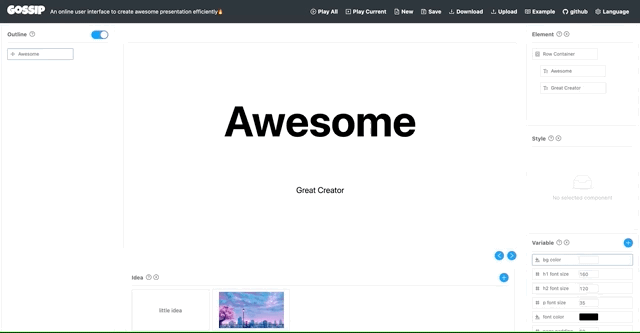

### Organizing: Outline and Thumbnails

**The organizing component involves making decisions about abstractions and ordering leading to hierarchical and linear structures.**

Most tools allow presenters to organize slides in a linear fashion, which is hard to understand or change the latent hierarchical relations among them. Some tools enable users to order hierarchical structures, such as [Keynote](https://www.apple.com/keynote/) or [Prezi](https://prezi.com/), but they are still not good enough.

In Gossip, there is an *Outline panel* to help presenters to make a clear hierarchy efficiently. Also a *Thumbnail panel* is provided to preview the whole presentation.

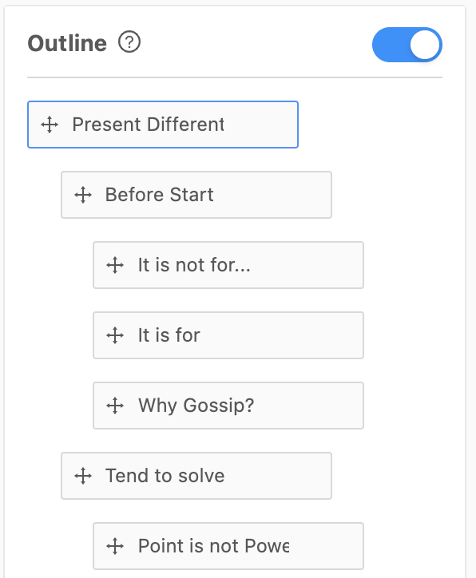&emsp;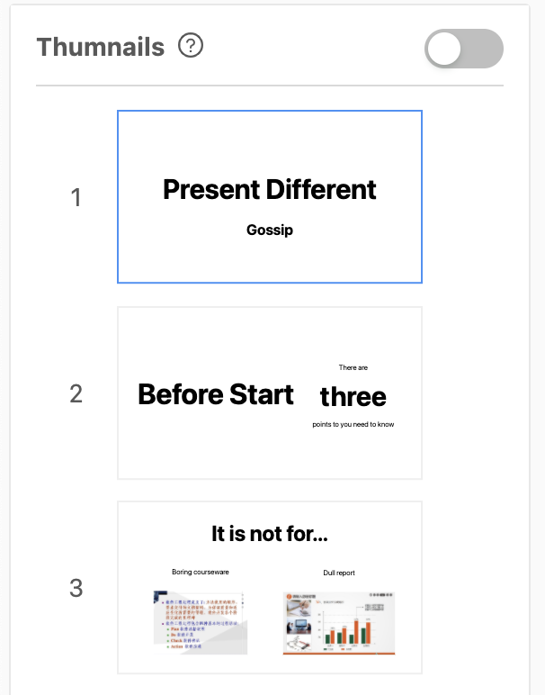

In the *Outline panel*, when the presenter creates a new point node, Gossip will automatically create a slide for it. And users can simply drag a node to modify the linear order or hierarchical structure of the presentation rather than dragging many nodes for a slight change.

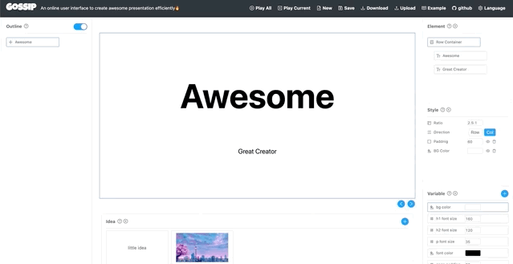

### Composing: Main and Element

**In the composing stage, the author takes the structure developed in the generating and organization stages and turns it into an actual usable product.**

At this stage, it often requires a lot of drag and aligns operations to set the right position or size of each element (text, image, etc.) which is very time-consuming and annoying. This is because there are no constraints between elements which means users have to layout every element manually.

But it is possible to add constraints for elements according to the logical structure, so Gossip allows the user to organize elements in a hierarchical structure in the *Element panel* and changes there will be reflected in the *Maini panel*.

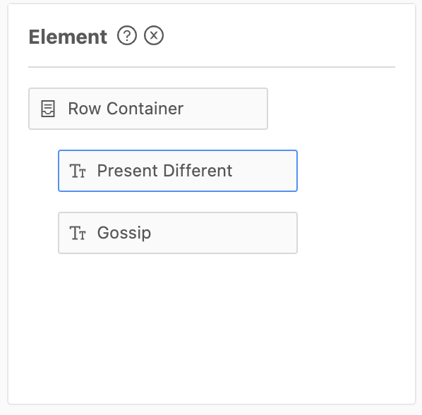

With the help of **[CSS Flexible Box Layout](https://en.wikipedia.org/wiki/CSS_Flexible_Box_Layout)**, Gossip provides the *container* element to manage other elements, such as texts, images, container, etc. Users can add elements to the container and specify their arrangement(horizontal or vertical) and proportion(1:1 or 1:3).

One of the main advantages is that for each element, Gossip will automatically set the proper position or size of it according to its container's styles(padding, direction, etc.) and the other elements in that container. The other one is that users can operate a group of elements rather than just one each time.

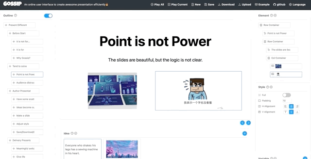

### Revising: Style and Variable

**Lastly, the revision stage involves reviewing the work, adding new ideas, and fixing inconsistencies with the original organization.**

The features introduced above already have shown that it is pretty easy to add, delete, edit each slide, and adjust the structure of the whole presentation in Gossip. Those are related to the content of the presentation, but there is also a need to make change styles easy. To solve this problem, Gossip offers a *Style* and *Variable panel* to presenters.

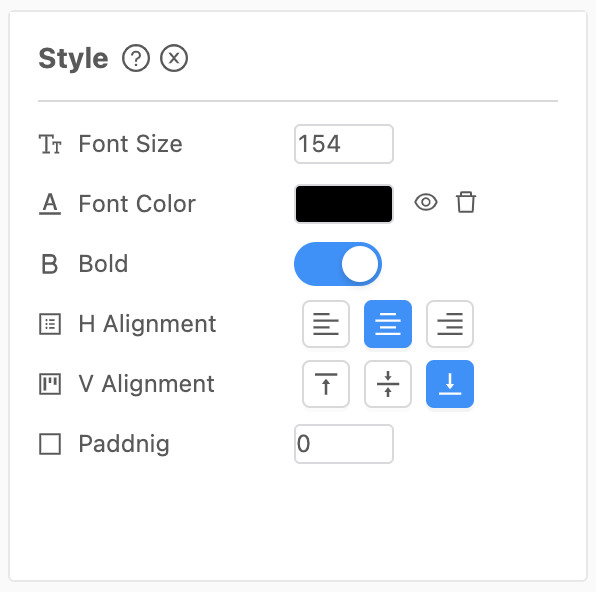&emsp;

For those elements which tend to have the same or similar styles, such as the font color of highlight texts or the font size of the title, Gossip enables the user to create a variable and assign to these elements. **When the user changes the value of that variable, Gossip will change the value of those related elements as well!**

## Delivery a presentation

To hold the audience's interests and help the presenter communicate the structure of a presentation to the audience, Gossip uses some cool but meaningful switch animation and a *Word Cloud* mode for the overview.

### Switch animation: Zoom in, Zoom out, Rotate

The *Zoom in animation* will remind the audience of a big point to a small point. And *Zoom out animation* is for a small point to a big point. If the two points are at the same level, it will be the *Rotate animation*.

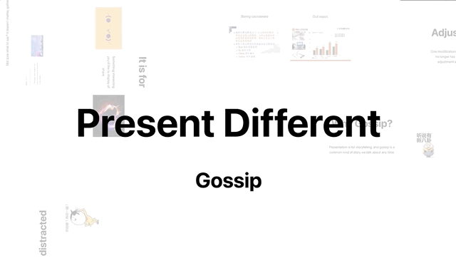&emsp;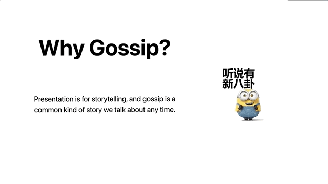&emsp;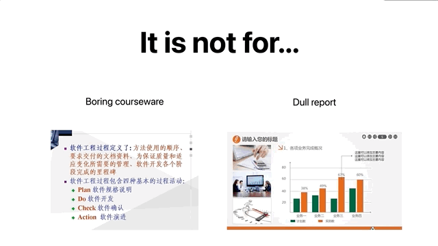

### Overview: Word Cloud mode

*Word Cloud* mode uses a traditional word cloud algorithm to layout each slide. As a result, the audience can quickly familiarize or review the general content of the entire presentation. It is also helpful when the audience asks the presenter a question about a specific slide because the presenter needn't scroll the mouse wheel to find the specific slide.

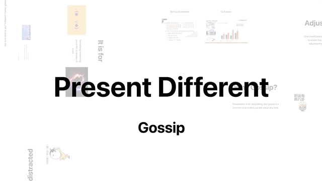

## Limitations

There are some limitations in Gossip now.

- Outline is not flexible enough.
- Variables are not easy enough to use.
- Layout method is not convent enough.
- No support for animation, template, shortcuts, redo, undo, etc.
- The context provided during delivery is not enough.
- Word cloud mode has some problems.

## Future works

- Solve the problems mentioned above.
- Design a better UI.

## Contributing

Gossip 1.0 is just a course project at the beginning, we need your support and advice to improve the code and features of it.

If you like Gossip, not only can you give it a star, you can also do the following things.

- Join [Telegram](https://t.me/joinchat/S4-TmBwTcGFnmSYM0gxsdw) to discuss.
- Give us the slides you made by Gossip and we will display some of them.
- Fill out the [questionnaire](https://www.wjx.cn/jq/77277467.aspx).
  
## Tech stack

- [React](https://reactjs.org/)
- [umi@2.x](https://v2.umijs.org/)
- [antd@3.x](https://3x.ant.design/)
